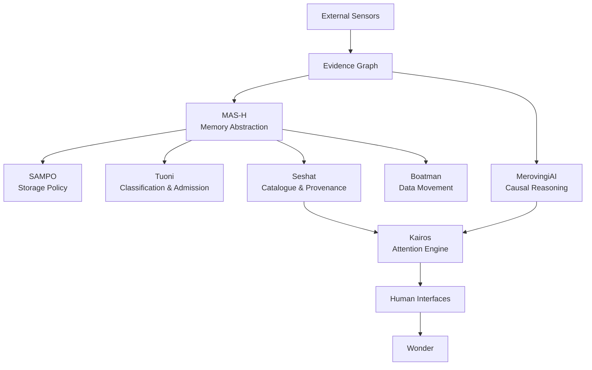

# Kairos

> **The machine should remember so the human can wander with their mind free to wonder.**

Kairos is a semantic life operating system.

It is not a second brain.

It is not a note-taking application.

It is not a chatbot.

It is not a knowledge graph.

Those are implementations.

Kairos is an attempt to redesign the relationship between humans and computers by treating attention as the most valuable resource a person possesses.

Instead of asking humans to maintain software, Kairos asks software to maintain context.

Its purpose is not to think for people.

Its purpose is to remember, understand, explain and quietly surface what matters, allowing people to remain fully present.

---

## Philosophy

Modern software assumes humans should maintain information.

Update your calendar.

Organise your files.

Remember birthdays.

Tag your notes.

Reconnect conversations.

Track unfinished projects.

Maintain bookmarks.

Rename documents.

Humans become administrators of digital systems.

Kairos reverses that relationship.

The machine maintains context.

The human remains curious.

The machine remembers.

The human wonders.

---

## Why

Human attention is finite.

Ideas are not.

The modern world demands an enormous amount of cognitive bookkeeping.

Remember where something was saved.

Remember why a project stalled.

Remember who introduced you to someone.

Remember which repository contains the prototype.

Remember which conversation inspired an idea.

Remember promises.

Remember intentions.

None of these tasks are intellectually interesting.

Together, they consume a significant portion of our attention.

Kairos exists because curiosity is more valuable than administration.

---

## Core Principles

### Reality becomes evidence

Kairos does not think in terms of applications.

Everything becomes evidence.

A Git commit.

A conversation.

A calendar event.

A journal entry.

A photograph.

A website.

A task.

A voice note.

A document.

A relationship.

A memory.

A location.

Each piece of evidence carries provenance.

- Where did it come from?
- When was it created?
- How trustworthy is it?
- What does it relate to?
- What changed?
- Why does it matter?

Applications disappear.

Evidence remains.

---

### Context is more important than storage

Storage is solved.

Context is not.

Kairos is not interested in collecting information.

It is interested in understanding relationships.

A Git commit belongs to a project.

That project belongs to a research area.

That research area originated from a conversation.

That conversation inspired an article.

That article changed the direction of another project.

The relationships matter more than the files themselves.

---

### Memory without obligation

Kairos is not an external brain.

It is an external responsibility.

The goal is not perfect recall.

The goal is removing the obligation to continually remember everything.

When memory becomes trustworthy, attention becomes available again.

---

### Understanding instead of retrieval

Finding information is easy.

Understanding information is difficult.

Kairos continuously asks questions such as:

- Why did this project stall?
- Which ideas continue resurfacing?
- What assumptions have changed?
- Which unfinished thoughts belong together?
- What quietly became important while I was focused elsewhere?
- What deserves my attention right now?

Its purpose is explanation.

Not prediction.

Understanding.

Not search.

---

## Architecture

Kairos is composed of independent systems, each responsible for a single cognitive function.

---

## Components

### Kairos

The attention engine.

Kairos asks only one question:

> **Given everything we know, what deserves attention right now?**

It stores nothing.

It simply orchestrates.

---

### MAS-H

https://github.com/R2Pitou/Mas-h

Memory Abstraction System.

Responsible for storing evidence independently of storage technology.

Everything entering Kairos becomes managed evidence.

---

### SAMPO

Storage Abstraction Management & Policy Orchestrator.

Determines where evidence should live throughout its lifecycle.

Hot storage.

Cold storage.

Archive.

Replication.

Retention.

---

### Tuoni

The gatekeeper.

Determines whether evidence belongs within the system.

Validates provenance.

Measures confidence.

Requests additional evidence when uncertainty remains.

---

### Seshat

The catalogue.

Maintains provenance, metadata and relationships.

Answers:

- What is this?
- Where did it come from?
- When was it observed?
- How has it changed?

---

### Boatman

Moves evidence between storage tiers while preserving provenance.

Invisible infrastructure.

---

### MerovingiAI

The causality engine.

MerovingiAI transforms evidence into explanations.

Rather than asking:

> What happened?

it asks:

> Why did this happen?

It reasons across relationships, builds causal hypotheses and explains conclusions using supporting evidence.

---

## Sensors

Kairos is source agnostic.

Everything that observes reality can become a sensor.

Examples include:

- Git repositories
- Markdown documents
- Local filesystem
- Calendars
- Telegram
- Email
- Browsing history
- Voice recordings
- Journal entries
- Websites
- RSS feeds
- CCTV
- GPS
- Photos
- IoT devices

The sensor changes.

The architecture does not.

---

## Design Philosophy

Kairos is inspired by the ancient Greek distinction between **Chronos** and **Kairos**.

Chronos measures time.

Kairos represents the right moment.

Modern software constantly pulls attention into the past and future.

Kairos attempts to carry enough context that attention can remain in the present.

---

## Vision

Kairos is not an AI assistant.

It is a cognitive operating system.

A trusted steward of context.

A system that quietly remembers, understands and explains reality so that people can spend less time maintaining information and more time exploring ideas.

Because human curiosity is too valuable to spend on bookkeeping.

---

> **The machine should remember.**
>
> **The machine should explain.**
>
> **The human should wonder.**
>
> **Only then is the human truly free to be present.**